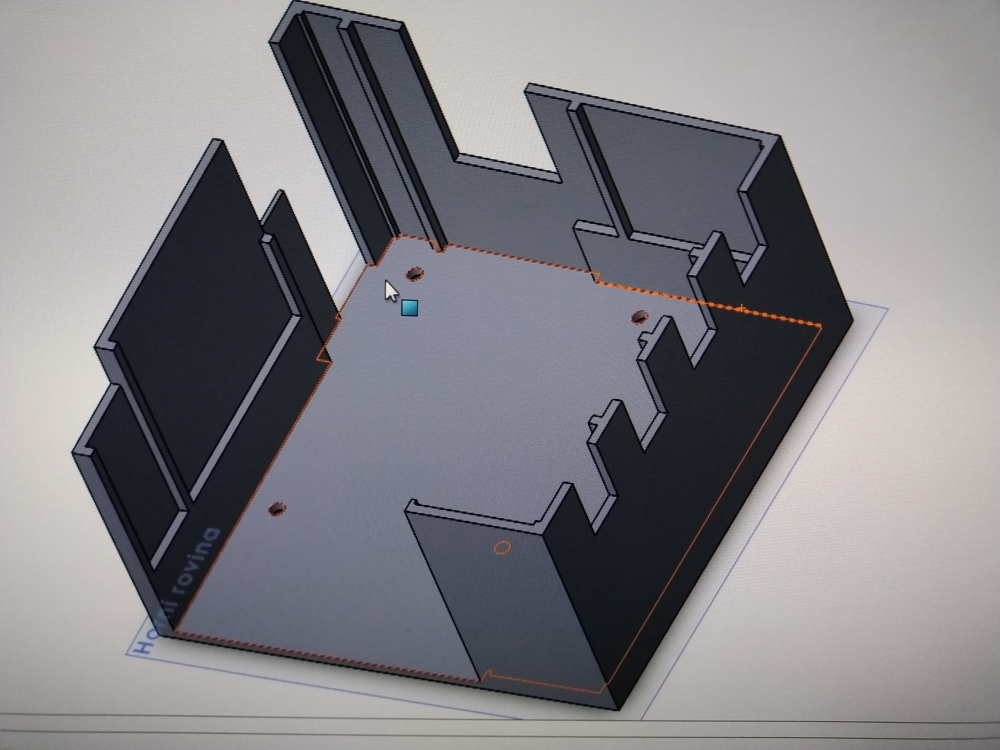

# Sentry Gun 
Sentry gun is my first big python project. It detects moving objects on camera and aims on them with laser beacon.

## Table of contents
* [Introduction](#Introduction)
* [Technologies](#Technologies)
* [Requirements](#Requirements)
* [Launch](#Launch)
* [Model](#Model)
* [License](#License)]

## Introduction
It's a stationary Raspberry Pi acting as a Client and connected to the Server via static local IP address via Ethernet cable.
It identifies moving objects captured via a camera connected to the CSI connector on Raspberry Pi. The Client creates a session that constantly sends captured images. While the Server-side replies with the x and y-axis for servo motors. 

Based on the stream of data Server compares each captured image with the reference image that was created before movement.
Using Binary Threshold function the program builds individual contours of differences in the captured image and then calculates the center of the bigger object on camera. This center point is then sent back to the Raspberry Pi that uses them to aim at the detected object.


## Technologies
This project uses [OpenCV](https://opencv.org/) library for basic Computer Vision and Preprocessing of an image. 

The Raspberry Pi for relatively portable system using Python 2. 
The CSI camera module for high quality image stream for best movement recognition.
Basic acelerometer for solving unconvinient movements of the whole system.
Servomotors controlled by Pulse Width Modulation signalling.

## Requirements
For the recreation of this project you neeed to have:

      Raspberry Pi (at least Model 2)
      CSI module camera (at least 7 Mpx)
      Servomotors connected to the GPIOPINOUTS
      Laser Beacon
      Accelrometer with ISP
      Computer with installed Python 3 and mentioned libraries
      3D printed model of the whole system
      Ethernet cable
      

## Launch
To create this program you need to clone this repo for both Client and Server. Install the required 
libraries (and Python if you don't have it installed yet) and set static IP address on Server side.
### Clone
First you need to clone this repo to both Server and Client.
```
$git clone https://github.com/davidus27/sentrygun/tree/master 
$cd sentrygun
```
### Install libraries
You need to install required libraries for both Server and Client.
#### Server:
```
$sudo pip3 install server-requirements.txt
```
#### Client (Raspberry Pi):
```
$sudo pip install client-requirements.txt
```
#### Static IP address
You need to connect Server with Client throught Ethernet cable and set static IP address. 
If you have Windows you can follow [this](https://portforward.com/networking/static-ip-windows-10.htm) awesome tutorial.
If you are on Linux systems you probably know what you are doing anyway.

#### Startup
To start the program you need to first start python program on Server-side:
```
$python3 sample/server.py
```
Then on Client:
```
$python sample/client.py
```
More info about installing OpenCV library you need to go to the official [tutorial](https://docs.opencv.org/master/df/d65/tutorial_table_of_content_introduction.html).

##Model
You can use basic model structure for mounting of all necessary parts in folder "models" in AutoCAD.
Size of 3D printed box is 10x10x10 cm. 



## License
This project is licensed under the MIT License - see the [LICENSE](LICENSE) file for details.
